[[Paper](https://arxiv.org/abs/2309.17207)] [[Installation](#installation)]  [[Usage](#usage)] [[Mortar Mayhem](#mortar-mayhem)] [[Endless Mortar Mayhem](#endless-mortar-mayhem)] [[Mystery Path](#mystery-path)] [[Endless Mystery Path](#endless-mystery-path)] [[Searing Spotlights](#searing-spotlights)] [[Endless Searing Spotlights](#endless-searing-spotlights)] [[Training](#training)]

# Memory Gym: Towards Endless Tasks to Benchmark Memory Capabilities of Agents

<table align="center">
  <tr>
    <td></td>
    <td>Endless Mortar Mayhem</td>
    <td>Endless Mystery Path</td>
    <td>Endless Searing Spotlights</td>
  </tr>
  <tr>
    <td>Agent Observation</td>
    <td>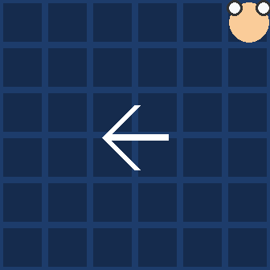</td>
    <td>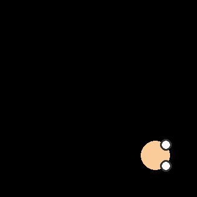</td>
    <td>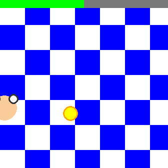</td>
  </tr>
  <tr>
    <td>Ground Truth</td>
    <td>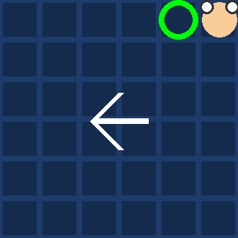</td>
    <td>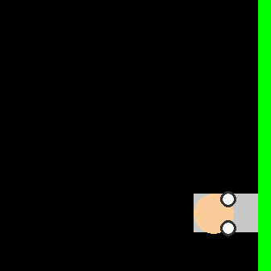</td>
    <td></td>
  </tr>
</table>


Memory Gym features the environments **Mortar Mayhem**, **Mystery Path**, and **Searing Spotlights** that are inspired by some mini games of [Pummel Party](http://rebuiltgames.com/). These 2D environments benchmark the memory capabilities of agents.
Especially, these environments feature endless task variants. As the agent's policy improves, the task goes on. The cumulative memory game "I packed my bag ..." inspired this dynamic concept, which allows for examining levels of effectiveness instead of just sample efficiency.
Interactive videos, based on selected agent behavios, can be found here: [https://marcometer.github.io/](https://marcometer.github.io/jmlr_2024.github.io/)

## Citation

Preprint Journal Paper (under review)
```bibtex
@misc{pleines2024memory,
      title={Memory Gym: Towards Endless Tasks to Benchmark Memory Capabilities of Agents}, 
      author={Marco Pleines and Matthias Pallasch and Frank Zimmer and Mike Preuss},
      year={2024},
      eprint={2309.17207},
      archivePrefix={arXiv},
      primaryClass={cs.LG}
}
```

ICLR Paper
```bibtex
@inproceedings{pleines2023memory,
      title={Memory Gym: Partially Observable Challenges to Memory-Based Agents},
      author={Marco Pleines and Matthias Pallasch and Frank Zimmer and Mike Preuss},
      booktitle={International Conference on Learning Representations},
      year={2023},
      url={https://openreview.net/forum?id=jHc8dCx6DDr}
}
```

## Installation

Major dependencies:
- gymnasium==0.29.0
- PyGame==2.4.0

```console
conda create -n memory-gym python=3.11 --yes
conda activate memory-gym
pip install memory-gym
```

or

```console
conda create -n memory-gym python=3.11 --yes
conda activate memory-gym
git clone https://github.com/MarcoMeter/drl-memory-gym.git
cd drl-memory-gym
pip install -e .
```


## Usage
[](https://colab.research.google.com/drive/1LjlUOEer8vjGrz0rLM8pP5UyeNCsURkY?usp=sharing)

Executing the environment using random actions:
```python
import memory_gym
import gymnasium as gym

env = gym.make("Endless-SearingSpotlights-v0")
# env = gym.make("SearingSpotlights-v0")
# env = gym.make("Endless-MortarMayhem-v0")
# env = gym.make("MortarMayhem-v0")
# env = gym.make("MortarMayhem-Grid-v0")
# env = gym.make("MortarMayhemB-v0")
# env = gym.make("MortarMayhemB-Grid-v0")
# env = gym.make("Endless-MysteryPath-v0")
# env = gym.make("MysteryPath-v0")
# env = gym.make("MysteryPath-Grid-v0")

# Pass reset parameters to the environment
options = {"agent_scale": 0.25}

obs, info = env.reset(seed=1, options=options)
done = False
while not done:
    obs, reward, done, truncation, info = env.step(env.action_space.sample())

print(info)
```

Manually play the environments using the console scripts (works only using an anaconda environment):
```console
mortar_mayhem
# MMAct
mortar_mayhem_b
# MMGrid
mortar_mayhem_grid
# MMAct Grid
mortar_mayhem_b_grid
mystery_path
mystery_path_grid
searing_spotlights

# Endless Environments
endless_mortar_mayhem
endless_mystery_path
endless_searing_spotlights
```

You can also execute the python scripts directly, for example:
```
python ./memory_gym/mortar_mayhem.py
```

Controls:
- WASD or Arrow Keys to move or rotate
- Page Up / Page Down to increment / decrement environment seeds

## Mortar Mayhem

<table align="center">
  <tr>
    <td>Agent Observation</td>
    <td>Ground Truth</td>
  </tr>
  <tr>
    <td>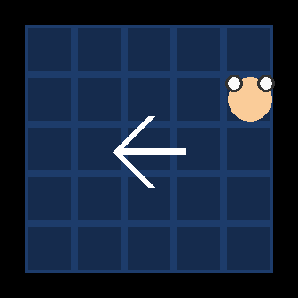</td>
    <td>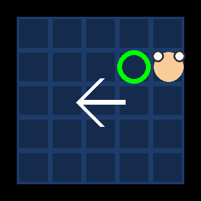</td>
  </tr>
</table>

Mortar Mayhem challenges the agent with a sequence of commands that the agent has to memorize and execute in the right order. During the beginning of the episode, each command is visualized one by one. Mortar Mayhem can be reduced to solely executing commands. In this case, the command sequence is always available as vector observation (one-hot encoded) and, therefore, is not visualized.

The max length of an episode can be calculated as follows:

```
max episode length = (command_show_duration + command_show_delay) * command_count + (explosion_delay + explosion_duration) * command_count - 2
```


### Reset Parameters

| Parameter              | Default | Description                                                                                                                                       |
|------------------------|--------:|---------------------------------------------------------------------------------------------------------------------------------------------------|
| agent_scale            |    0.25 | The dimensions of the agent.                                                                                                                      |
| agent_speed            |     3.0 | The speed of the agent.                                                                                                                           |
| arena_size             |       5 | The grid dimension of the arena (min: 2, max: 6)                                                                                                  |
| allowed_commands       |       9 | Available commands: right, down, left, up, stay, right down, right up, left down, left up. If set to five, the first five commands are available. |
| command_count          |     [10] | The number of commands that are asked to be executed by the agent. This is a list that the environment samples from.                              |
| command_show_duration  |     [3] | The number of steps that one command is shown. This is a list that the environment samples from.                                                  |
| command_show_delay     |     [1] | The number of steps between showing one command. This is a list that the environment samples from.                                                |
| explosion_duration     |     [6] | The number of steps that an agent has to stay on the commanded tile. This is a list that the environment samples form.                            |
| explosion_delay        |    [18] | The entire duration in steps that the agent has to execute the current command. This is a list that the environments samples from.                |
| visual_feedback        |    True | Whether to turn off the visualization of the feedback. Upon command evaluation, the wrong tiles are rendered red.                                 |
| reward_command_failure |     0.0 | What reward to signal upon failing at the current command.                                                                                        |
| reward_command_success |     0.1 | What reward to signal upon succeeding at the current command.                                                                                       |
| reward_episode_success |     0.0 | What reward to signal if the entire command sequence is successfully solved by the agent.                                                         |

## Endless Mortar Mayhem

To extend the core concept of Mortar Mayhem to Endless Mortar Mayhem, we introduce an ever-growing command sequence. The phases of displaying and executing commands are alternated. Only one command is shown before command execution, while the agent must execute all previously displayed commands in the underlying episode. To accommodate a potentially infinite command sequence, the arena undergoes a screen wrap, behaving like a torus.

### Reset Parameters

| Parameter              | Default | Description                                                                                                                                       |
|------------------------|--------:|---------------------------------------------------------------------------------------------------------------------------------------------------|
| max_steps            |    -1 | Maximum number of steps that an episode may last. If less than 1, the episode length is not limited by this reset parameter.                                                                                                                      |
| agent_scale            |    0.25 | The dimensions of the agent.                                                                                                                      |
| agent_speed            |     3.0 | The speed of the agent.                                                                                                                           |
| allowed_commands       |       9 | Available commands: right, down, left, up, stay, right down, right up, left down, left up. If set to five, the first five commands are available. |
| initial_command_count            |     1 | Specifies the number of commands that are initially shown.                                                                                                                           |
| command_show_duration  |     [3] | The number of steps that one command is shown. This is a list that the environment samples from.                                                  |
| command_show_delay     |     [1] | The number of steps between showing one command. This is a list that the environment samples from.                                                |
| explosion_duration     |     [6] | The number of steps that an agent has to stay on the commanded tile. This is a list that the environment samples form.                            |
| explosion_delay        |    [18] | The entire duration in steps that the agent has to execute the current command. This is a list that the environments samples from.                |
| visual_feedback        |    True | Whether to turn off the visualization of the feedback. Upon command evaluation, the wrong tiles are rendered red.                                 |
| reward_command_failure |     0.0 | What reward to signal upon failing at the current command.                                                                                        |
| reward_command_success |     0.1 | What reward to signal upon succeeding at the current command (dense reward setting).                                                              |
| reward_new_command_success |     0.0 | What reward to signal upon completing all commands of the current list of commands (sparse reward setting).            |

## Mystery Path

<table align="center">
  <tr>
    <td>Agent Observation</td>
    <td>Ground Truth</td>
  </tr>
  <tr>
    <td>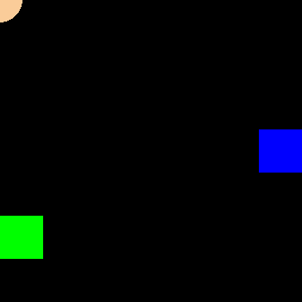</td>
    <td>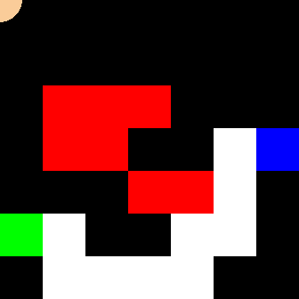</td>
  </tr>
</table>

Mystery Path procedurally generates an invisible path for the agent to cross from the origin to the goal. Per default, only the origin of the path is visible. Upon falling off the path, the agent has to restart from the origin. Note that the episode is not terminated by falling off. Hence, the agent has to memorize where it fell off and where it did not.


### Reset Parameters

| Parameter              |      Default | Explanation                                                                                                                 |
|------------------------|-------------:|-----------------------------------------------------------------------------------------------------------------------------|
| max_steps              |          512 | The maximum number of steps for the agent to play one episode.                                                              |
| agent_scale            |         0.25 | The dimensions of the agent.                                                                                                |
| agent_speed            |          3.0 | The speed of the agent.                                                                                                     |
| cardinal_origin_choice | [0, 1, 2, 3] | Allowed cardinal directions for the path generation to place the origin. This is a list that the environment samples from.  |
| show_origin            |         False | Whether to hide or show the origin tile of the generated path.                                                              |
| show_goal              |        False | Whether to hide or show the goal tile of the generated path.                                                                |
| visual_feedback        |         True | Whether to visualize that the agent is off the path. A red cross is rendered on top of the agent.                           |
| reward_goal            |          1.0 | What reward to signal when reaching the goal tile.                                                                          |
| reward_fall_off        |          0.0 | What reward to signal when falling off.                                                                                     |
| reward_path_progress   |          0.0 | What reward to signal when making progress on the path. This is only signaled for reaching another tile for the first time. |
| reward_step            |          0.0 | What reward to signal for each step.                                                                                        |

## Endless Mystery Path

<p align=center>
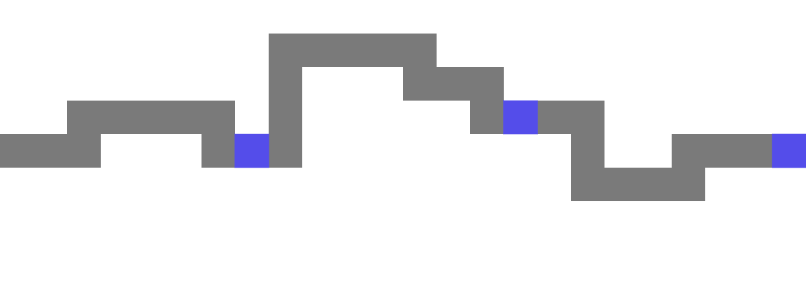
</p>

In Endless Mystery Path, a never-ending path is generated by exploiting the path generation of Mystery Path, which concatenates path segments. The terminal conditions of an episode need to be varied to accommodate the design of short episodes without making progress. The episode terminates if the agent fails to make progress within a few steps. Termination also occurs if the agent falls off before reaching its farthest progress, and the agent cannot fall off at the same location twice.

### Reset Parameters

| Parameter              |      Default | Explanation                                                                                                                 |
|------------------------|-------------:|-----------------------------------------------------------------------------------------------------------------------------|
| max_steps              |          -1 | The maximum number of steps for the agent to play one episode. If smaller than 1, the episode is not affected by this reset parameter.                                                              |
| agent_scale            |         0.25 | The dimensions of the agent.                                                                                                |
| agent_speed            |          3.0 | The speed of the agent.                                                                                                     |
| show_origin            |         False | Whether to hide or show the origin tile of the generated path.                                                              |
| show_past_path            |         True | Whether to hide or show the path behing the agent.                                                              |
| show_background              |        False | Whether to hide or show a tiled background.                                                                |
| show_stamina              |        False | Whether to hide or show a stamina bar indicating the remaining time to make progress on the path.                                                                |
| visual_feedback        |         True | Whether to visualize that the agent is off the path. A red cross is rendered on top of the agent.                           |
| camera_offset_scale        |         5.0 | Offset of the camera's X position. Decreasing this value will hide more of the path behind the agennt.                           |
| stamina_level            |          20 | Number of steps that the agent has time to touch on the next path tile leading to progress.                                                                          |
| reward_fall_off        |          0.0 | What reward to signal when falling off.                                                                                     |
| reward_path_progress   |          0.1 | Reward signaled whenever the agent reaches a new tile that it has not visited before (sparse reward setting). |
| reward_path_progress_dense |      0.0 | Reward signaled whenever the agent reaches the next tile (dense reward setting).                              |
| reward_step            |          0.0 | What reward to signal for each step.                                                                                        |

## Searing Spotlights

<table align="center">
  <tr>
    <td>Agent Observation</td>
    <td>Ground Truth</td>
  </tr>
  <tr>
    <td>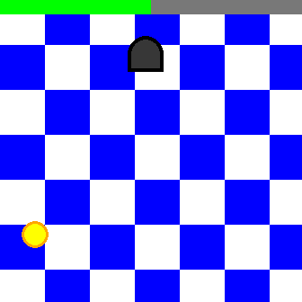</td>
    <td>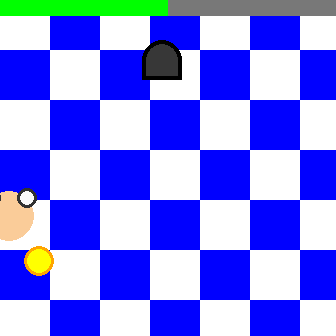</td>
  </tr>
</table>

Searing Spotlights is a pitch black surrounding to the agent. The environment is initially fully observable but the light is dimmed untill off during the first few frames. Only randomly moving spotlights unveil information on the environment's ground truth, while posing a threat to the agent. If spotted by spotlight, the agent looses health points. While the agent must avoid closing in spotlights, it further has to collect coins. After collecting all coins, the agent has to take the environment's exit.


### Reset Parameters

| Parameter                | Default | Explanation                                                                                                     |
|--------------------------|--------:|-----------------------------------------------------------------------------------------------------------------|
| max_steps                |     -1 | The maximum number of steps for the agent to play one episode. If smaller than 1, the episode is not affected by this reset parameter.                                                  |
| steps_per_coin                |     160 | Number of steps that the agent has to collect a newly spawned coin.                                                  |
| agent_scale              |    0.25 | The dimensions of the agent.                                                                                    |
| agent_speed              |     3.0 | The speed of the agent.                                                                                         |
| agent_health             |     5 | The initial health points of the agent.                                                                         |
| agent_visible            |   False | Whether to make the agent permanently visible.                                                                  |
| sample_agent_position    |    True | Whether to hide or show the goal tile of the generated path.                                                    |
| num_coins                |     [1] | The number of coins that are spawned. This is a list that the environment samples from.                         |
| coin_scale               |   0.375 | The scale of the coins.                                                                                         |
| coins_visible            |   False | Whether to make the coins permanently visible.                                                                  |
| use_exit                 |    True | Whether to spawn and use the exit task. The exit is accessible by the agent after collecting all coins.         |
| exit_scale               |     0.0 | The scale of the exit.                                                                                          |
| exit_visible             | False   | Whether to make the exit permanently visible.                                                                   |
| initial_spawns           | 3       | The number of spotlights that are initially spawned.                                                            |
| spawn_interval | 50      | Number of steps to spawn a new spotlight.                                              |
| spot_min_radius          | 7.5     | The minimum radius of the spotlights. The radius is sampled from the range min to max.                          |
| spot_max_radius          | 13.75   | The maximum radius of the spotlights. The radius is sampled from the range min to max.                          |
| spot_min_speed           | 0.0025  | The minimum speed of the spotlights. The speed is sampled from the range min to max.                            |
| spot_max_speed           | 0.0075  | The maximum speed of the spotlights. The speed is sampled from the range min to max.                            |
| spot_damage              | 1.0     | Damage per step while the agent is spotted by one spotlight.                                                    |
| light_dim_off_duration   | 6       | The number of steps to dim off the global light.                                                                |
| light_threshold          | 255     | The threshold for dimming the global light. A value of 255 indicates that the light will dimmed of completely.  |
| visual_feedback          | True    | Whether to render the tiled background red if the agent is spotted.                                             |
| black_background         | False   | Whether to render the environments background black, while the spotlights are rendered as white circumferences. |
| hide_chessboard          | False   | Whether to hide the chessboard background. This renders the background of the environment white.                           |
| show_last_action         | True    | Whether to encode and render the previouss action to the visual observation.                                    |
| show_last_positive_reward | True   | Whether to render if the agent received a positive reward on the previous step.                                 |
| reward_inside_spotlight  | 0.0     | What reward to signal for each step while being inside a spotlight.                                             |
| reward_outside_spotlight | 0.0     | What reward to signal for each step while being outside of a spotlight.                                         |
| reward_death             | 0.0     | What reward to signal upon losing all health points.                                                            |
| reward_coin              | 0.25    | What reward to signal upon collecting one coin.                                                                 |

## Endless Searing Spotlights

Endless Searing Spotlights solely revolves around a coin collection task, with no consideration of an exit task leading to episode termination. Upon collecting the only coin present, a new one is immediately spawned. The agent operates under a limited time budget to collect the newly spawned coin.

### Reset Parameters

| Parameter                | Default | Explanation                                                                                                     |
|--------------------------|--------:|-----------------------------------------------------------------------------------------------------------------|
| max_steps                |     -1 | The maximum number of steps for the agent to play one episode.                                                  |
| agent_scale              |    0.25 | The dimensions of the agent.                                                                                    |
| agent_speed              |     3.0 | The speed of the agent.                                                                                         |
| agent_health             |     10 | The initial health points of the agent.                                                                         |
| agent_visible            |   False | Whether to make the agent permanently visible.                                                                  |
| sample_agent_position    |    True | Whether to hide or show the goal tile of the generated path.                                                    |
| coin_enabled             |    True | Whether the coin collection task is enabled or disabled                                                         |
| coin_show_duration       |     6 | How many steps to make the coin visible to the agent unill its hidden behind the dark.                         |
| coin_scale               |   0.375 | The scale of the coins.                                                                                         |
| coins_visible            |   False | Whether to make the coins permanently visible.                                                                  |
| steps_per_coin            |   160 | Time budget to collect a single coin.                                                                  |
| initial_spawns           | 3       | The number of spotlights that are initially spawned.                                                            |
| spawn_interval   | 50      | The number of steps until the next spotlight is spawned.                                                        |
| spot_min_radius          | 7.5     | The minimum radius of the spotlights. The radius is sampled from the range min to max.                          |
| spot_max_radius          | 13.75   | The maximum radius of the spotlights. The radius is sampled from the range min to max.                          |
| spot_min_speed           | 0.0025  | The minimum speed of the spotlights. The speed is sampled from the range min to max.                            |
| spot_max_speed           | 0.0075  | The maximum speed of the spotlights. The speed is sampled from the range min to max.                            |
| spot_damage              | 1.0     | Damage per step while the agent is spotted by one spotlight.                                                    |
| light_dim_off_duration   | 6       | The number of steps to dim off the global light.                                                                |
| light_threshold          | 255     | The threshold for dimming the global light. A value of 255 indicates that the light will dimmed of completely.  |
| visual_feedback          | True    | Whether to render the tiled background red if the agent is spotted.                                             |
| black_background         | False   | Whether to render the environments background black, while the spotlights are rendered as white circumferences. |
| hide_chessboard          | False   | Whether to hide the chessboard background. This renders the background of the environment white.                           |
| show_last_action         | True    | Whether to encode and render the previouss action to the visual observation.                                    |
| show_last_positive_reward | True   | Whether to render if the agent received a positive reward on the previous step.                                 |
| reward_inside_spotlight  | 0.0     | What reward to signal for each step while being inside a spotlight.                                             |
| reward_outside_spotlight | 0.0     | What reward to signal for each step while being outside of a spotlight.                                         |
| reward_death             | 0.0     | What reward to signal upon losing all health points.                                                            |
| reward_coin              | 0.25    | What reward to signal upon collecting one coin.                                                                 |

## Training

Baseline results are avaible via these repositories.

[Recurrence + PPO](https://github.com/MarcoMeter/recurrent-ppo-truncated-bptt)

[TransformerXL + PPO](https://github.com/MarcoMeter/episodic-transformer-memory-ppo)

## Changelog

v1.0.0

Improvements
- All environment concepts are extrapolated to endless episodes!
    - Endless Mortar Mayhem
    - Endless Mystery Path
    - Endless Searing Spotlights
- Improved simulation speed by using already rotated sprites and not rotating the character's surface every frame
- Mystery Path: A* obstacle walls are also placed now on the environments boundary to mitigate trivial paths
- All endless environments feature a ground truth space. As specified by this space ground truth information is added to the info dictionary
- Searing Spotlights may also visualize whether a positive reward was signaled on the previous frame

Breaking Changes
- Refactored the info key "exit_success" in Searing Spotlights to "success"

Bug Fixes
- Fixed the speed of character controller, because moving downwards was slower than moving upwards due to float truncation
